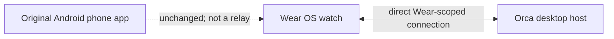
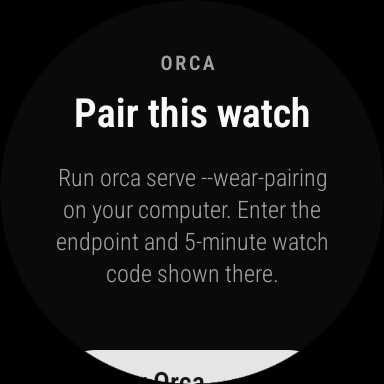
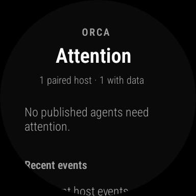
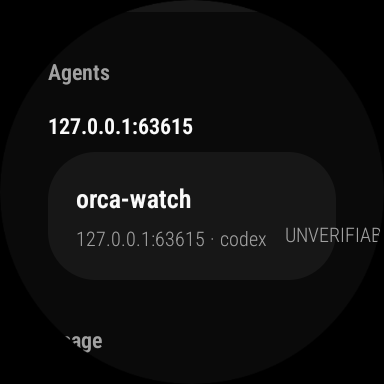
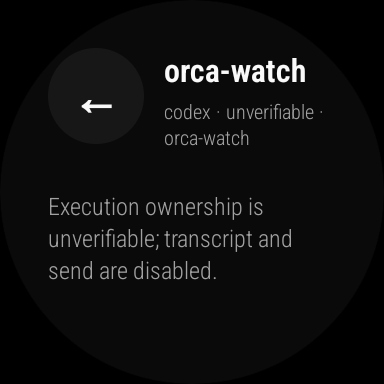
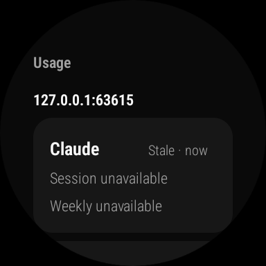
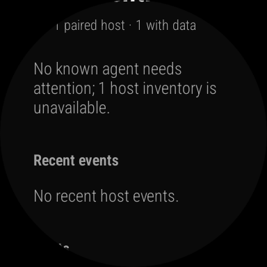
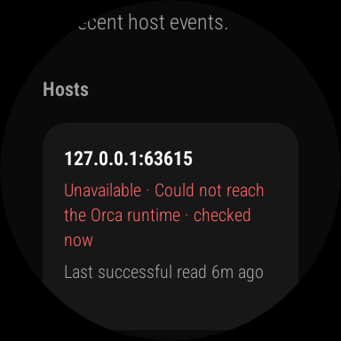
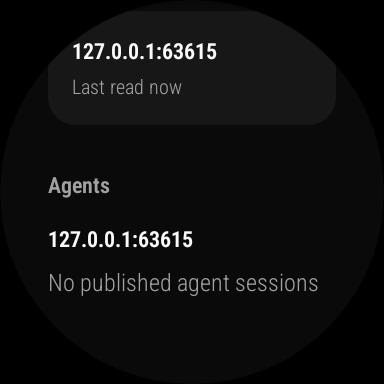
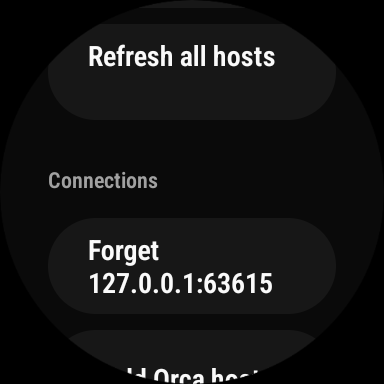

# Orca Watch

Orca Watch is an open-source Wear OS companion for the
[Orca desktop app](https://github.com/Dhi13man/orca). It puts agent attention,
host status, usage, and conversations on a smartwatch. The watch connects
directly to a compatible Orca host; the original Android phone app is unchanged.

**[Download the 0.0.1 developer preview](https://github.com/Dhi13man/orca-watch/releases/tag/v0.0.1)**
 · [Install and pair](#install-and-pair) · [Verified flows](#emulator-walkthrough)
 · [Build](#build-from-source) · [Security](SECURITY.md)

## What works today

| Flow | Current behavior | Evidence |
| --- | --- | --- |
| Pair a host | Enter its endpoint and short-lived code, or open its pairing link on the watch. Each host gets a separate Wear-scoped grant. | [Pairing screen](docs/screenshots/wearos-pairing.png); emulator enrollment and physical Watch8 pairing |
| Attention and agents | Read published attention, recent host events, host freshness, and agent inventory. An unreachable host stays **unavailable**, never falsely **stopped**. | [Attention](docs/screenshots/wearos-attention.png), [agent card](docs/screenshots/wearos-agent-card.png), [offline state](docs/screenshots/wearos-offline.png) |
| Usage | Show provider usage when the host has it; label absent or stale values. | [Unavailable usage](docs/screenshots/wearos-usage.png) |
| Conversations and replies | The app supports exact-target conversation and reply routing. It blocks both when execution ownership cannot be verified. | [Safety gate](docs/screenshots/wearos-conversation-gate.png); isolated software tests, **no physical reply acceptance yet** |
| Reconnect and forget | Keep the watch pairing across app and host restarts, refresh a returning host, or remove a connection on the watch. | [Offline host](docs/screenshots/wearos-offline-host.png), [reconnected host](docs/screenshots/wearos-reconnected.png), [connections](docs/screenshots/wearos-connections.png) |

`0.0.1` is a **developer preview**. A Samsung Watch8 installed the signed
release APK, paired with a live Orca host, and displayed a real Attention
dashboard. Physical replies, multi-host and SSH-host operation, remote-network
access, and timely screen-off alerts remain unverified. See
[Current limits](#current-limits) before relying on it.

## How it connects



The watch needs a network route to the host. Normal Bluetooth pairing to a
phone does not relay Orca data, and this project does not bundle Tailscale for
Wear OS. On a private LAN, use `ws://`; outside it, use a correctly configured
`wss://` endpoint. The watch does not receive desktop runtime credentials or
arbitrary RPC access.

## Emulator walkthrough

These screenshots come from a **Wear OS 4, API 33, x86_64 emulator** running a
current-source local build. An isolated Orca host was reached through an ADB
port reverse, so they demonstrate the app flows, **not off-LAN connectivity**.
No production host, phone app, or existing pairing was used. The screenshots
are not a claim that every flow passed on the signed `0.0.1` APK.

### 1. Enroll and view Attention

The watch begins at pairing. After a one-time link enrolled the isolated host,
Attention showed one paired host with data. An empty attention list means no
*published* agent needed attention at that read; it does not assert that all
agents everywhere were idle.

| Pairing | Attention after enrollment |
| :---: | :---: |
|  |  |

### 2. Inspect agents, conversations, and usage

The isolated host published a Codex session, but the watch marked its execution
ownership **unverifiable**. Opening that agent disabled transcript and send,
which is the expected safe result. The host did not supply current Claude usage,
so the watch showed it as stale and unavailable instead of inventing a value.

| Agent inventory | Conversation safety gate | Usage freshness |
| :---: | :---: | :---: |
|  |  |  |

No message was sent to an active user session. Successful watch reply delivery
still needs a verified idle target and end-to-end acceptance.

### 3. Lose contact, reconnect, and manage a host

After stopping the isolated host, the watch retained cached data and labeled
its inventory unavailable. Its host card showed the last successful read as
six minutes old. Restarting the same host profile and watch app restored a
fresh read without another pairing. The Connections area then offered a
watch-side **Forget** action; using it returned to pairing.

| Unavailable inventory | Last successful read |
| :---: | :---: |
|  |  |
| Reconnected | Connection controls |
|  |  |

## Install and pair

### Requirements

- A Wear OS watch running Android API 33 or newer.
- An Orca host with Wear RPC support. Until that reaches an Orca release, build
  the host from [the Wear branch](https://github.com/Dhi13man/orca/tree/Dhi13man/ship-orca-wearos)
  at commit `3b222b0a9` or later.
- A direct network route from the watch to that host.

### Install the APK

Download the signed ARMv7 APK from the [0.0.1 release](https://github.com/Dhi13man/orca-watch/releases/tag/v0.0.1)
and install it on the watch. Its package ID is `com.stably.orca.wearos`; it can
sit beside earlier developer test builds. Android rejects an update signed by
a different key. Preserve the installed app and its data if that check fails.

### Pair a reachable host

On the Orca host, run:

```sh
orca serve --wear-pairing --pairing-address <watch-reachable-host-address>
```

Open Orca Watch. Enter the endpoint and five-minute code from the host, then
tap **Connect**. The host also provides a pairing link that can be opened on
the watch. Treat that link as a credential: do not paste it into issues or logs.
Pair additional hosts separately.

## Build from source

The Wear OS app and its native packages live in [wearos/](wearos/). Node 24,
pnpm 10.24.0, JDK 17, and the Android SDK are required.

```sh
cd wearos
pnpm install --frozen-lockfile
pnpm typecheck
pnpm lint
pnpm format:check
pnpm test
pnpm exec expo prebuild --platform android --no-install
bash android/gradlew -p packages/expo-wear-data-layer/jvm-tests test
cd android
./gradlew :app:assembleRelease -PreactNativeArchitectures=armeabi-v7a
```

The local Gradle output uses Android's standard **debug key**. Use it for local
testing, not as a trusted public release. Release APKs need a private signing
key outside this repository. The generated `wearos/android/` directory and
`google-services.json` are ignored by Git. On Windows, use
`android\gradlew.bat` for native tests and `gradlew.bat` for the APK build.

## Current limits

- Network loss makes the host **unavailable**; it does not prove an agent exited.
- Firebase push is not configured. Periodic background refresh cannot promise
  timely screen-off alerts.
- Physical multi-host, SSH-host, and reply acceptance remain open.
- There is no Play Store publication in `0.0.1`.
- watchOS is planned as a separate future module; no watchOS app exists yet.

See [SECURITY.md](SECURITY.md) for the trust boundary and private reporting,
[CONTRIBUTING.md](CONTRIBUTING.md) for contributions, and [CHANGELOG.md](CHANGELOG.md)
for release history. The repository is MIT licensed; see [LICENSE](LICENSE).
