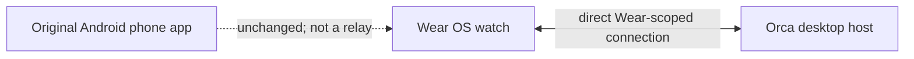

# Orca Watch

Orca Watch is an open-source Wear OS smartwatch companion for
[Orca](https://github.com/Dhi13man/orca). It connects directly to a compatible
Orca desktop host to show agent attention, host status, and usage. Conversation
reading and exact-target replies are implemented but have not passed a live
watch-to-agent acceptance test.

**[Download the 0.0.1 developer preview](https://github.com/Dhi13man/orca-watch/releases/tag/v0.0.1)**
 · [Install and pair](#install-and-pair) · [Build](#build-from-source)
 · [Security](SECURITY.md)

## Preview status

- **Watch8 install and pairing:** The signed `0.0.1` APK installed, paired to a
  live Orca host, and displayed an Attention dashboard.
- **Emulator enrollment and reconnect:** A Wear OS 4 emulator paired to an
  isolated host, retained its grant after an app restart, and refreshed when
  the host returned after network loss.
- **Live agent inventory:** The emulator listed a newly launched Codex agent
  in an isolated worktree using the existing login. Its provider session was
  **unverified**.
- **Conversation and reply:** **Not accepted end to end.** The watch withheld
  transcript and send for that unverified terminal. No successful watch reply
  has been demonstrated.
- **Usage and alerts:** Missing usage was labeled unavailable. Firebase push
  is not configured; periodic refresh cannot promise timely screen-off alerts.

There is no screenshot of a working watch conversation because that flow has
not been proved. The earlier gallery of mostly unavailable states has been
removed. Current source also contains a more compact watch dashboard than the
already-published `0.0.1` APK; a new signed build has not been released.

## How it connects



The watch needs a network route to its host. Normal Bluetooth pairing to a
phone does not relay Orca data, and this project does not bundle Tailscale for
Wear OS. Use `ws://` on a private LAN or a correctly configured `wss://`
endpoint beyond it. The watch does not receive desktop runtime credentials or
arbitrary RPC access.

## Install and pair

### Requirements

- A Wear OS watch running Android API 33 or newer.
- An Orca host with Wear RPC support. Until that reaches an Orca release, build
  the host from [the Wear branch](https://github.com/Dhi13man/orca/tree/Dhi13man/ship-orca-wearos)
  at commit `3b222b0a9` or later.
- A direct network route from the watch to that host.

### Install the APK

Download the signed ARMv7 APK from the [0.0.1 release](https://github.com/Dhi13man/orca-watch/releases/tag/v0.0.1)
and install it on the watch. Its package ID is `com.stably.orca.wearos`; it can
sit beside earlier developer test builds. Android rejects an update signed by
a different key. Preserve the installed app and its data if that check fails.

### Pair a reachable host

On the Orca host, run:

```sh
orca serve --wear-pairing --pairing-address <watch-reachable-host-address>
```

Open Orca Watch. Enter the endpoint and five-minute code from the host, then
tap **Connect**. The host also provides a pairing link that can be opened on
the watch. Treat that link as a credential: do not paste it into issues or logs.
Pair additional hosts separately.

## Build from source

The Wear OS app and its native packages live in [wearos/](wearos/). Node 24,
pnpm 10.24.0, JDK 17, and the Android SDK are required.

```sh
cd wearos
pnpm install --frozen-lockfile
pnpm typecheck
pnpm lint
pnpm format:check
pnpm test
pnpm exec expo prebuild --platform android --no-install
bash android/gradlew -p packages/expo-wear-data-layer/jvm-tests test
cd android
./gradlew :app:assembleRelease -PreactNativeArchitectures=armeabi-v7a
```

The local Gradle output uses Android's standard **debug key**. Use it for local
testing, not as a trusted public release. Release APKs need a private signing
key outside this repository. The generated `wearos/android/` directory and
`google-services.json` are ignored by Git. On Windows, use
`android\gradlew.bat` for native tests and `gradlew.bat` for the APK build.

## Current limits

- Network loss makes a host **unavailable**; it does not prove an agent exited.
- Physical multi-host, SSH-host, off-network, and reply acceptance remain open.
- There is no Firebase push or Play Store publication in `0.0.1`.
- watchOS is a possible future module; no watchOS app exists yet.

See [SECURITY.md](SECURITY.md) for the trust boundary and private reporting,
[CONTRIBUTING.md](CONTRIBUTING.md) for contributions, and [CHANGELOG.md](CHANGELOG.md)
for release history. The repository is MIT licensed; see [LICENSE](LICENSE).
